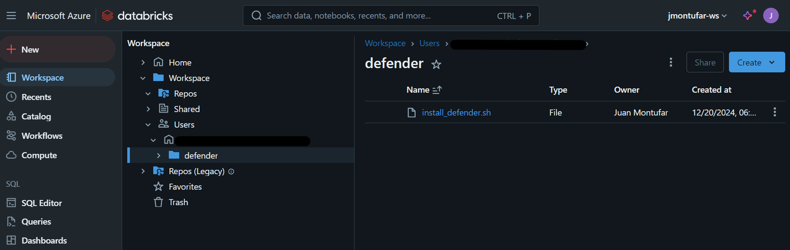
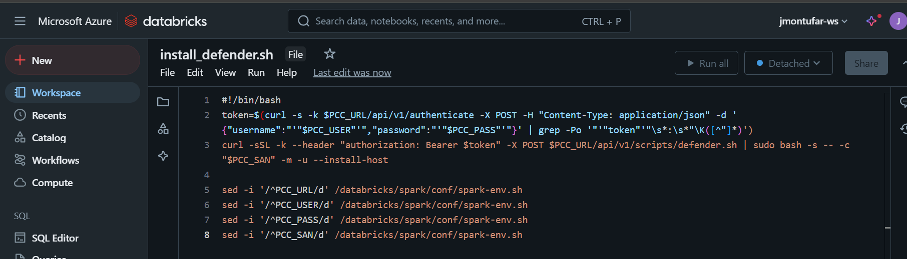
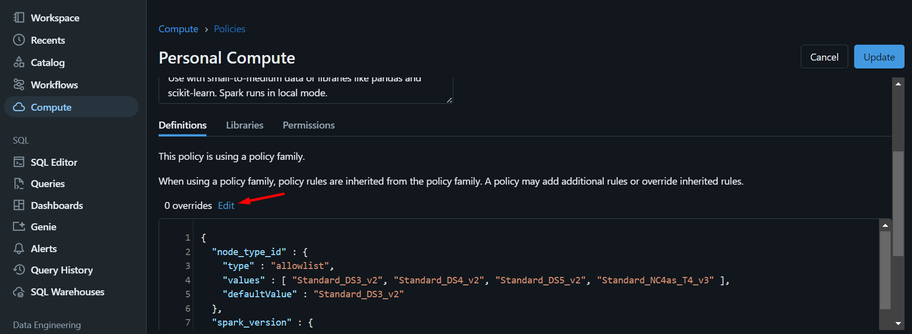
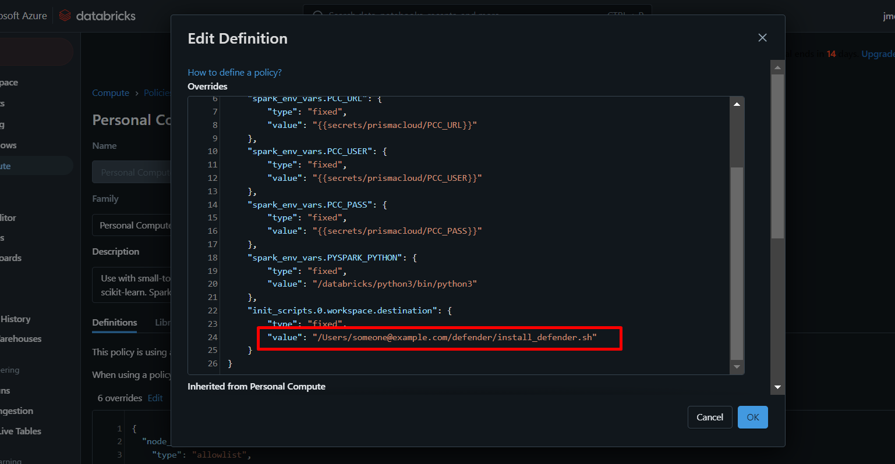
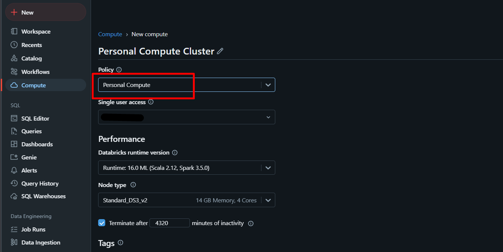
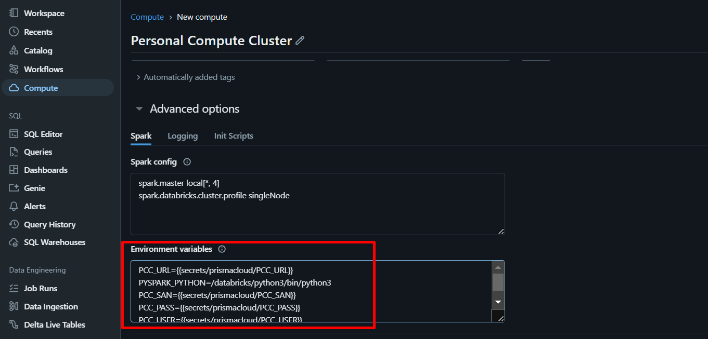
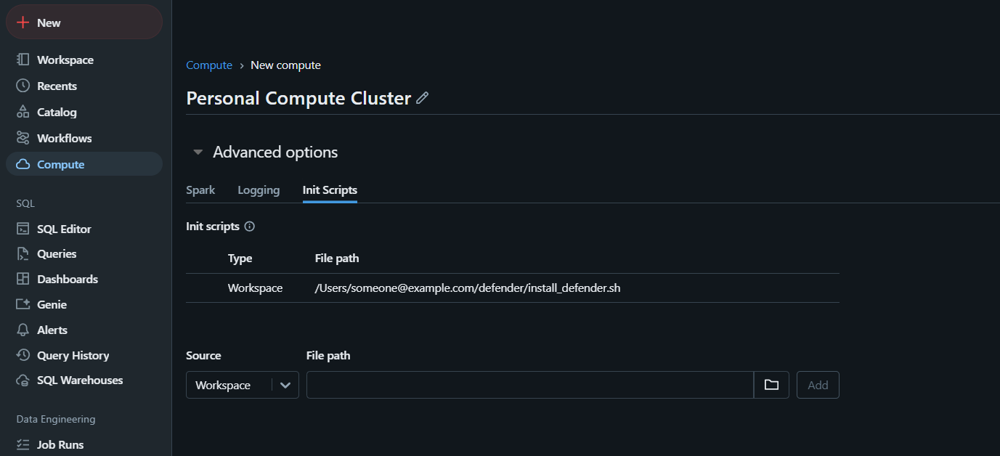

# Deploy Prisma Cloud Defender in Databricks
This guide shows how to deploy Prisma Cloud Defender in Databricks Cluster

## Step 1: Prisma Cloud Service Account
It's required to create the service account as instructed in the [Pre-requisites](https://github.com/PaloAltoNetworks/pcs-cwp-host-autodefend?tab=readme-ov-file#permissions)

## Step 2: Store the secrets
It's is required to create secrets either through the Databricks default secret storage or through any Secrets service of your choice. In this scenario, it will be used the Databricks default secret storage. To do that do the following:

1. Download [databricks cli](https://docs.databricks.com/en/dev-tools/cli/tutorial.html) if not installed.
2. Create an [Personal Access Token](https://docs.databricks.com/en/dev-tools/auth/pat.html) to authenticate with databricks. The user or Service Account must have access to create secret scopes and create secrets in such scope.
2. Configure databricks with the following command:
    ```bash
    databricks configure
    ```
    Please include the Personal Access Token and the Databricks URL to authenticate
3. Create a secret scope called **prismacloud**
    ```bash
    databricks secrets create-scope prismacloud
    ```
4. Store the [general variables](https://github.com/PaloAltoNetworks/pcs-cwp-host-autodefend?tab=readme-ov-file#general-variables) in the scope.
    ```bash
    databricks secrets put-secret prismacloud PCC_URL
    databricks secrets put-secret prismacloud PCC_USER
    databricks secrets put-secret prismacloud PCC_PASS
    databricks secrets put-secret prismacloud PCC_SAN
    ```
    This values should be saved as text not as json.


> **NOTES**
> - This process can change depending on your Secrets Management providers. Please refer to you corresponding provider to verify the integration.

## Step 3: Upload Script
In the Databricks console, go to **Workspace**. Here choose any path of your preference and create a file with the content of the file *install_script.sh* from this repository.







> **NOTES**
> - Instead of using workspaces you can use volumes. 

## Step 4: 
Edit an existing Compute Policy by going to **Compute** > **Policies** > Select the appropriate policy > **Edit** > and again click on the **edit** option next to the word *overrides*:



Here place the contents of the file *compute-policy-overrides.json* and replace the **SCRIPT_PATH** for the corresponding full path where the script is located.



Once done save it.


> **NOTES**
> - If you are using volumes, then in the *compute-policy-overrides.json* you should replace the word **worplace** by **volumes**.
> - You can also create your own compute policy to match your requirements when the cluster is being created.
> - For more information regarding compute policies, visit the official [databricks documentation](https://docs.databricks.com/en/admin/clusters/policy-definition.html).

## Step 5: Create Cluster
Once is all set, create a Cluster and be sure to assign the overrided policy and verify that the overrides are in place.





