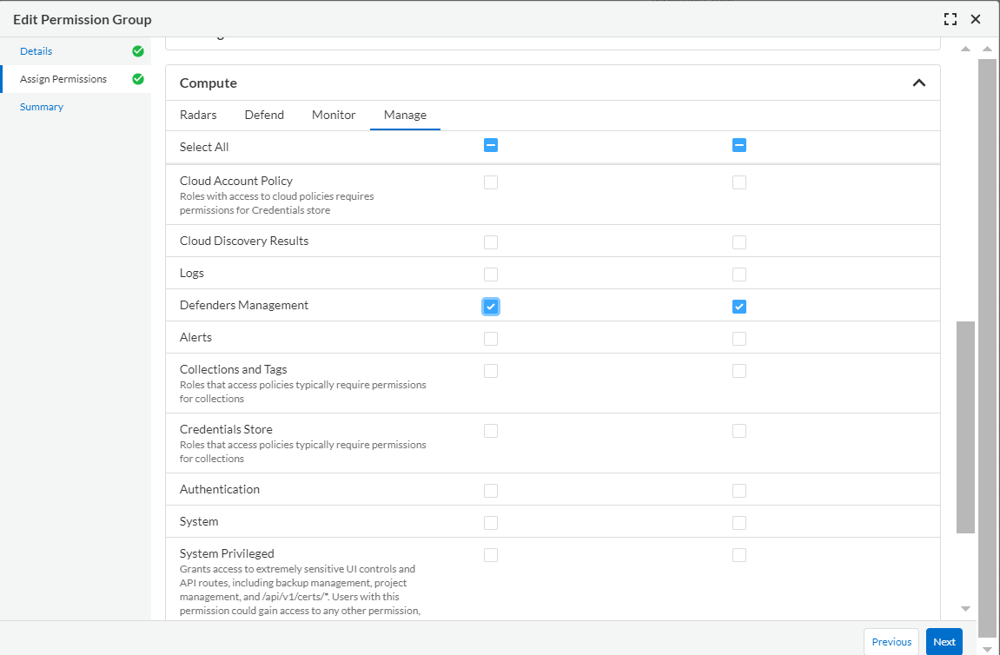

# Prisma Cloud CWP - Deploy Host Defenders
Automation processes to install defenders for Windows or Linux instances with or without containers in AWS, Azure and GCP

## Pre-Requisites
### Permissions
In order for the automation processes to work in Prisma Cloud, you must create a Permissions Group with View and Update for the Defenders Management permission. While you are creating a Permissions Group, the Defenders Management and System permissions can be found under **Assing Permissions** > **Compute** > **Manage** as in the following image:

Once created this permissions group, you must create a role and then the belonging service account.

